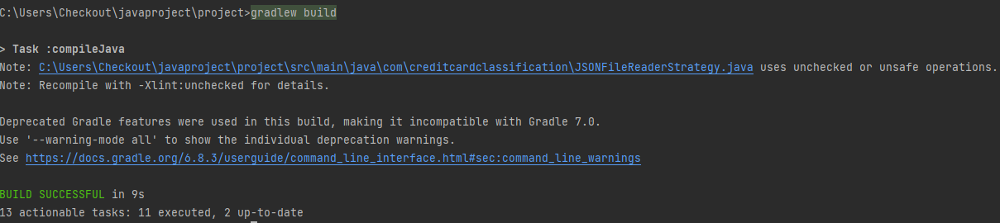
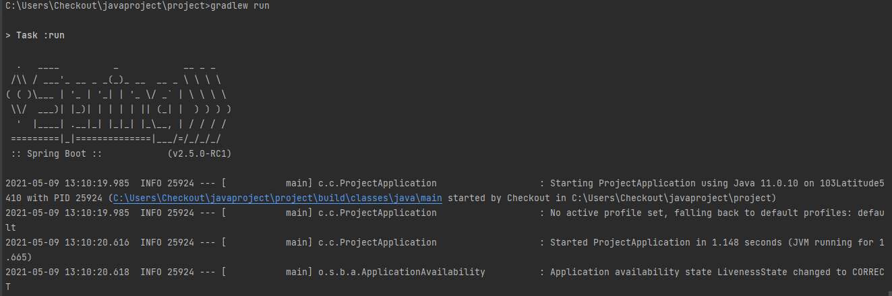
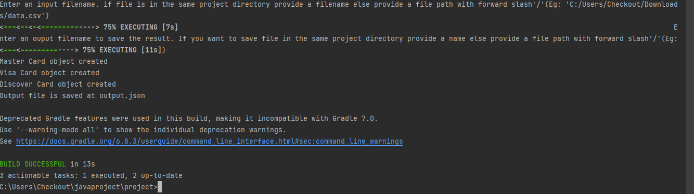

### **To run the Project**

#### **Requirements: JDK 11**

Steps:
1. Clone the project and cd to the root folder.
`cd individual-project-poojakota17`
   
2. In linux, to build the project,run the following command
`./gradlew build`
   
   1. If prompts as permission denied, run command:
`chmod +x *`
      
    2. To run the project 
     `./gradlew run`
       
3. In Windows, to build the project,run the following command 
    `gradlew build`
   1. To run the project
        `gradlew run`
4. In case of any IDE, follow the same commands in terminal or Click 'Run' to run the project.      
5. Give the input filename and output filename while project is running. If input filename is in the root folder then only specify filename.(Some sample input files are already present in root folder named as data.csv,data.json and data.xml). If file is present in any other directory, then provide path to the file with forward slash.
6. Output after compiling :

   
7. Output after running the project:

   

8. Output shows, the valid credit card types object creation and where the output file is stored. 
